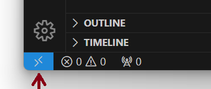
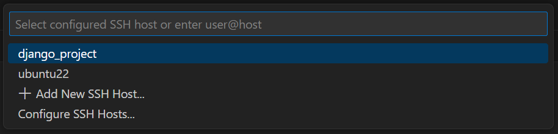

# Backend Developer VM with Vagrant

### Table of Contents

- [Install Vagrant](#install-vagrant)
- [Working Directory](#working-directory)
- [Update Vagrant](#update-vagrant)
- [Provision the VM](#provision-the-vm)
- [Use the VM](#use-the-vm)
- [VSCode + Remote SSH](#vscode--remote-ssh)
- [Updating the Vagrantfile](#updating-the-vagrantfile)
- [Synced Folders (Optional)](#synced-folders-optional)

Use [Vagrant](https://www.vagrantup.com/) and this repo to create a local Ubuntu
22.04 VM configured for Backend development. Detailed steps follow, but if you
already know Vagrant, it's the basic `vagrant up` and the other standard Vagrant
commands.

## Install Vagrant

Download Vagrant from the
[Vagrant downloads page](https://developer.hashicorp.com/vagrant/install?product_intent=vagrant)
for your operating system and install the application.

## Working Directory

Once you already have Vagrant installed and setup on your computer, choose any
folder as your working directory. The example below uses the folder
"django_project" under the home directory as the working directory.

```bash
cd ~
mkdir vagrant
cd vagrant
mkdir django_project
cd django_project
vagrant init
```

The last command initializes the current directory to be a Vagrant environment
by creating an initial Vagrantfile. You can configure the VM system settings in
the Vagrantfile. Use [Vagrantfile](/django_template/files/Vagrantfile) as an
example for your reference.

### Attention: if you are using MacOS, use `config.vm.box = "bento/ubuntu-22.04-arm64"` for the VM box

## Update Vagrant

Once you have configured the Vagrantfile, you can update the boxes and plugins
before creating the VM:

```bash
vagrant plugin update
vagrant box update
```

## Provision the VM

Open this repo in the terminal, and then enter:

```bash
vagrant up
```

That will generate a Vagrant-managed Ubuntu 22.04 VM following the instructions
in the _Vagrantfile_. That in-turn uses the Bash scripts in the `./provisioners`
folder. Examine those scripts to see what exactly is being done to the base
Ubuntu 22.04 VM.

## Use the VM

To enter the VM, run `vagrant ssh` from the repo folder. To SSH from anywhere,
run `vagrant ssh-config` and copy that to your `~/.ssh/config` folder. Then you
can `ssh $vagranthostname` from any terminal or from any client that uses the
SSH config file. Although consider renaming the box's host name from probably
_default_ to something more memorable (e.g., _Backendvagrant_).

See below for the output of `vagrant ssh-config`. You can change the name of
"Host" to anything you want, e.g., "django_project"

```bash
Host default # rename default to django_project as you wish
  HostName 127.0.0.1
  User vagrant
  Port 2211
  UserKnownHostsFile /dev/null
  StrictHostKeyChecking no
  PasswordAuthentication no
  IdentityFile C:/Users/your_profile/vagrant/django_project/.vagrant/machines/default/virtualbox/private_key
  IdentitiesOnly yes
  LogLevel FATAL
  PubkeyAcceptedKeyTypes +ssh-rsa
  HostKeyAlgorithms +ssh-rsa
```

To stop the VM, run: `vagrant suspend` (sleep) or `vagrant halt` (shutdown). The
next day, re-start the VM with `vagrant up` command or `vagrant reload`.

To destroy the VM, run: `vagrant destroy`. Re-create the VM with the
`vagrant up` command. If you do this, you'll need to create a new VM SSH key and
update both GitHub (see [VM's SSH key](#vms-ssh-key) for details).

Learn more in the
[Vagrant CLI documentation](https://www.vagrantup.com/docs/cli).

## VSCode + Remote SSH

If you're using Visual Studio Code, you can work directly with the VM using
VSCode's
[remote-ssh extension and workflow](https://code.visualstudio.com/docs/remote/ssh).
I.e., you're using VSCode installed on the host but working inside the VM via
SSH.

First, obtain the SSH configuration using `vagrant ssh-config` as described
previously. Then copy and paste the entire code to SSH configuration file in
your operating system. The SSH configuration file is usually located at the
folder under the home directory `~/.ssh/config`.

```bash
vi ~/.ssh/config
```

Then in VSCode, run the _Remote-SSH: Connect to Host_ command; find the Vagrant
VM host that you added to the SSH config file; and click to connect.

<div align="center">

</div>

<div align="center">

</div>

Choose _Linux_ in the next dialogue. This will open a new VSCode window that
operates in the VM via SSH. I.e, the file browser will look in the VM's file
system and the integrated terminal will open a Bash terminal in the VM.

## Updating the Vagrantfile

If there are changes to the Vagrantfile (e.g., increasing the RAM, changing the
sync folders, etc.), run this to capture the changes in the box:

```bash
cd path/to/this/repo
vagrant reload
```

## Synced Folders (Optional)

Another way is to setup sync folders that folders on your computer that are
mounted on the VM. Then you can make changes to anything in the sync folders
from either your host computer or from within the VM.

If you do this, point your IDE to the sync folders from your host computer side,
make changes, and then ``vagrant ssh` into the VM to run/test.

If you go this way, create a branch of this repo called _dev/$your-name_ and add
the sync folder configuration to the Vagrantfile. See the
[synced folder documentation](https://www.vagrantup.com/docs/synced-folders/basic_usage)
for more info.
